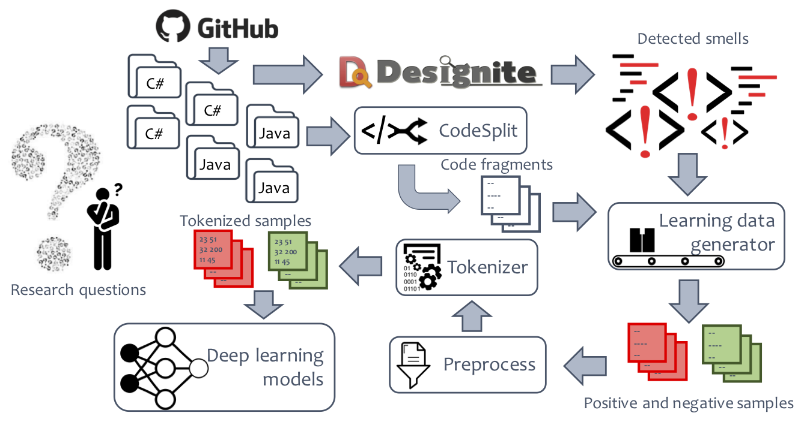

# Detecting smells using deep learning

## Overview
The figure below provides an overview of the experiment.
We download 1,072 C# and 100 Java repositories
from GitHub.
We use Designite and DesigniteJava
to analyze C# and Java code respectively.
We use CodeSplit to extract each method and class definition into separate files
from C# and Java programs.
Then the learning data generator uses the detected smells to bifurcate code
fragments into positive or negative samples for a smell - positive samples contains the smell
while the negative samples are free from that smell.
We apply preprocessing operations on these samples such as removing duplicates
and feed the output to Tokenizer.
Tokenizer takes a method or class definition and generates integer tokens for each
token in the source code.
The output of Tokenizer is ready to feed to neural networks.



## Generating Data and Curation
### Download repositories
We used the following protocol to identify and download our subject systems.
- We download repositories containing C# and Java code from GitHub.
We use RepoReapers [1] to filter out low-quality repositories.
	RepoReapers analyzes GitHub repositories and provides scores for nine dimensions
	their quality.
	These dimensions are architecture, community, continuous integration,
	documentation, history, license, issues, and unit tests.
- We selected all the repositories where at least 6 out of 8 and 7 out of 8
	RepoReapers' dimensions had suitable scores for C# and Java repositories
	respectively.
	We consider a score suitable if it has a value greater than zero.
- Next, we discarded repositories with less than 5 stars and less than 1,000 LOC.
- RepoReapers do not include forked repositories.
- Following these criteria, we get a filtered list of 1,072 C# and 2,528 Java repositories.
	We select 100 repositories randomly from the the filtered list of Java.
	Finally, we download and analyze 1,072 C# and 100 Java repositories.

### Smells detection
We use Designite to detect smells in C# code.
[Designite](http://www.designite-tools.com) is a software design quality assessment tool for projects written in C#.
It supports detection of eleven implementation, 19 design, and seven architecture smells.
It also provides commonly used code metrics and other features such as trend analysis,
code clones detection,
and dependency structure matrix to help us assess the software quality.
A free academic license can be requested for all the academic purposes.
Similar to the C# version, we developed
[DesigniteJava](https://github.com/tushartushar/DesigniteJava)
which is an open-source tool to analyze Java code.
We use DesigniteJava to detect smells in Java codebase.
The tool supports detection of 17 design and ten implementation smells.

We use console version of
Designite (version 2.5.10) and DesigniteJava (version 1.1.0) to
analyze C# and Java code respectively
and detect design and implementation smells in each of the downloaded repositories.

### Splitting code fragments
CodeSplit are utilities to split the methods or classes written in C# and Java source code into
individual files.
Hence, given a C# or Java project, the utilities can parse the code correctly
(using Roslyn for C# and Eclipse JDT for Java), and emit the individual methods or classes
fragments into separate files following hierarchical structure (i.e., namespaces/packages becomes folders).
CodeSplit for Java is an open-source project that can be found on
[GitHub](https://github.com/tushartushar/CodeSplitJava).
CodeSplit for C# can be downloaded freely
[online](@todo).

### Generating learning data
The learning data generator requires information from two sources:

1. A list of detected smells for each analyzed repository.

2. The path to the folder where code fragments are stored corresponding to the repository.

The program takes a method (or class in case of design smell) at a time and checks whether the given smell has been detected in the method (or class).
If yes, the program puts the code fragment into ```positive``` folder corresponding to the smell; otherwise
into the ```negative``` folder.

```
Input: smells_result_path, code_fragments_base_path, smells_list
Output: code fragments in learning_data/<smell>/(positive|negative) folders

for smell in smells_list:
    for repo in smells_result_path:
        all_smells_files = get files containing detected smells
        positive_file_list = initialize a list
        for file_smell_info in all_smells_files:
            file_name = read a line where detected smell is smell and compose a file name from namespace and class information
            if file_name exists in repo folder in code_fragments_base_path:
                add the file to positive_file_list
        for file in files in repo folder in code_fragments_base_path:
            if file is in positive_file_list:
                copy file in learning_data/<smell>/positive folder
             else
                copy file in learning_data/<smell>/negative folder
```

Here, smells_result_path has the following structure:
```
smells_result_path
	- repo_1
		- analysis_summary.csv
		- project1_archSmells.csv
		- project1_implSmells.csv
		- project1_designSmells.csv
		- project1_methodMetrics.csv
		- project1_classMetrics.csv
		- project2_archSmells.csv
		- project2_implSmells.csv
		- project2_designSmells.csv
		- project2_methodMetrics.csv
		- project2_classMetrics.csv
		...
	- repo_2
		...
	- repo_n
		...
```
```all_smells_files``` is a collection of files containing information about detected smells. For implementation smells, it is a list of ```projectN_implSmells.csv```; similarly, for design smells, it is a list of ```projectN_designSmells.csv```.

Each ```project1_implSmells.csv``` has the following columns:
```
Implementation_smell_name | Namespace_name | Class_name | File_path | Method_name | Description |
```

Each ```project1_designSmells.csv``` has the following columns:
```
Design_smell_name | Namespace_name | Class_name | File_path | Description |
```

### Tokenizing learning data
Machine learning algorithms including neural networks take vectors of numbers as input.
Hence, we need to convert source code into vectors of numbers honoring the language
keywords and other semantics.
[Tokenizer](https://github.com/dspinellis/tokenizer)
is an open-source tool to tokenize
source code into integer vectors, symbols, or discrete tokens.
It supports six programming languages currently including C# and Java.


```
Input: learning_data_path, smells_list
Output: tokenized output in tokenizer_out/<smell>/<dim>/(training|eval)/(positive|negative) folders

for all smell in smells_list do:
    for all dim in (1d, 2d) do:
        for all training_case in (training, eval) do:
            for all learning_case in (positive, negative) do:
                in_file = get file path at learning_data_path/smell/training_case/learning_case
                out_file = create a file if not exists at tokenizer_out/smell/dim/training_case/learning_case
                tokenized_file = tokenize in_file using tokenizer; pass appropriate parameters based on dim and programming language
                if size of out_file is greater than 50 MB:
                    out_file = create a new file
                append the contents of tokenized_file at the end of out_file
```

#### Data format
For 1D format, each sample is stored in a line.
```
Sample-1
Sample-2
...
```

For 2D format, two samples are separated by one new line
```
Sample-1-line1
Sample-1-line2
...
Sample-1-linen

Sample-2-line1
Sample-2-line2
...
Sample-2-linen

...
```

### Data preparation
The stored samples are read into numpy arrays, preprocessed, and filtered.
We first perform bare minimum preprocessing to clean the data.
For both 1D and 2D samples, we scan all the samples for each smell and remove
duplicates if exists.

We balance the number of samples for training by choosing the smaller number
from positive and negative sample count for training.
We discard the remaining training samples from the larger side.
We figure out the maximum input length (or, maximum input height and width in
    case of 2-D samples) for an individual sample.
To filter out the outliers, we read all the samples into a numpy array and
compute mean and standard deviation.
We discard all the samples where the length of the sample is greater than
mean + standard deviation.
This filtering helps us keeping the training set in reasonable bounds and
avoids waste of memory and processing resources.
Finally, we shuffle the array of input samples along with its corresponding labels array.

```
Input: tokenize_out_path, smell, dim
Output: training_data, training_labels, eval_data, eval_labels

for all training_case in (training, eval) do:
    folder_path = initialize the folder path for the training_case, smell, and dim
    filter out duplicates in the samples in folder_path
    if training_case is training:
        total_cases = initialize with minimum of total positive and negative samples
    outlier_threshold = read all samples into a numpy array, compute mean and standard deviation, and set the threshold at mean + standard deviation
    if training_case is training:
        data, labels = read all samples into a numpty array (maximum total_cases per positive and negative) of type float with size of sample less than the outlier_threshold and set their corresponding labels in the labels array
    else:
        data, labels = read all samples into a numpty array of type float with size of sample less than the outlier_threshold and set their corresponding labels in the labels array
    shuffle data and labels
```


## References
1. Nuthan Munaiah, Steven Kroh, Craig Cabrey, and Meiyappan Nagappan. 2017. Curating GitHub for engineered software projects. Empirical Software Engineering 22, 6 (01 Dec 2017), 3219–3253. https://doi.org/10.1007/s10664- 017- 9512- 6
